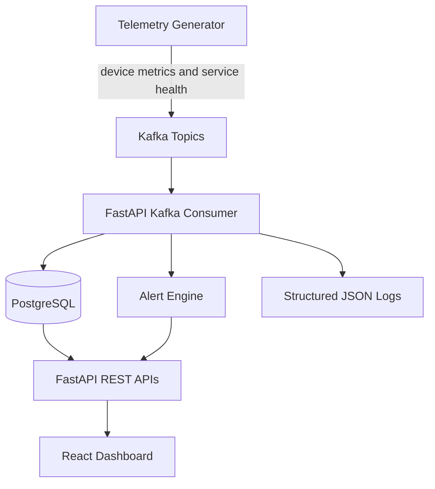

# InfraPulse

[](https://github.com/darshil040804/InfraPulse/actions/workflows/ci.yml)

InfraPulse is a portfolio-ready infrastructure observability dashboard. It simulates device and service telemetry, streams events through a Kafka-compatible broker, stores metrics in PostgreSQL, evaluates alert rules with FastAPI, and presents infrastructure health in a React dashboard.

## What It Demonstrates

- Infrastructure observability and alerting
- Simulated SNMP and NetFlow-style telemetry
- Kafka-compatible producer and consumer workflows
- FastAPI REST APIs with PostgreSQL persistence
- React, TypeScript, Tailwind CSS, and Recharts dashboard work
- Docker Compose orchestration
- Red Hat UBI-based backend container

## Architecture



## Local URLs

After the stack is running:

| Service | URL |
| --- | --- |
| React dashboard | http://localhost:3000 |
| FastAPI Swagger docs | http://localhost:8000/docs |
| FastAPI health check | http://localhost:8000/health |
| PostgreSQL | localhost:5432 |
| Kafka-compatible broker | kafka:9092 |

## Quick Start

1. Copy the environment file:

   ```powershell
   copy .env.example .env
   ```

2. Start the stack:

   ```powershell
   docker compose up --build
   ```

3. Open:

   - http://localhost:3000
   - http://localhost:8000/docs

The telemetry generator will start publishing events after the broker is healthy. The backend consumer stores metrics and creates alerts automatically.

## Demo Reset

Use the reset script before taking screenshots or recording a demo. It loads deterministic devices, metrics, alerts, and logs, then stops the telemetry generator so the UI stays stable.

```powershell
.\scripts\start.ps1
.\scripts\reset-demo.ps1
```

To resume live simulated telemetry after screenshots:

```powershell
docker compose up -d telemetry-generator
```

## Useful Commands

```powershell
.\scripts\start.ps1
.\scripts\reset-demo.ps1
.\scripts\test.ps1
.\scripts\stop.ps1
docker compose logs -f backend
docker compose logs -f telemetry-generator
```

## Portfolio Screenshots

Recommended screenshots for the README and portfolio writeup:

- React overview dashboard with live device and alert cards.
- Devices table showing hostnames, types, status, CPU, memory, and last seen.
- Device detail page with CPU, memory, latency, and packet loss charts.
- Alerts page with active warning or critical alerts.
- Logs page showing structured backend or telemetry events.
- FastAPI Swagger docs at `http://localhost:8000/docs`, with `GET /api/dashboard/summary` expanded and a successful JSON response visible.
- Terminal output from `docker compose ps` showing backend, frontend, postgres, broker, and telemetry services running.

Save final screenshots under `docs/screenshots/`. The detailed checklist is in [docs/portfolio-checklist.md](docs/portfolio-checklist.md).

## Ansible Automation

The Ansible playbook validates the local host, starts the Docker Compose stack, waits for the API health check, and prints operator commands.

```powershell
ansible-playbook -i ansible/inventory.ini ansible/deploy.yml
```

## GitHub Setup

Before committing, configure your local Git identity:

```powershell
git config --global user.name "Your Name"
git config --global user.email "YOUR_EMAIL"
```

This repo is already configured with:

```text
https://github.com/darshil040804/InfraPulse.git
```

After your first commit:

```powershell
git branch -M main
git push -u origin main
```

## Project Structure

```text
backend/              FastAPI app, SQLAlchemy models, Kafka consumer, tests
frontend/             React TypeScript dashboard
telemetry-generator/  Kafka telemetry producer
docs/                 Architecture and API notes
docker-compose.yml    Local platform orchestration
```

## Portfolio Positioning

InfraPulse is intended to be shown as a production-style local platform. The complete stack runs locally with Docker Compose. A lightweight public demo can later deploy only the React frontend, FastAPI backend, and hosted PostgreSQL while documenting Kafka and logging features through screenshots and demo media.
