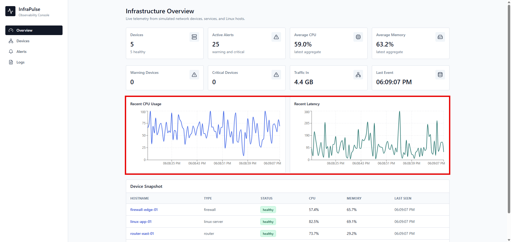
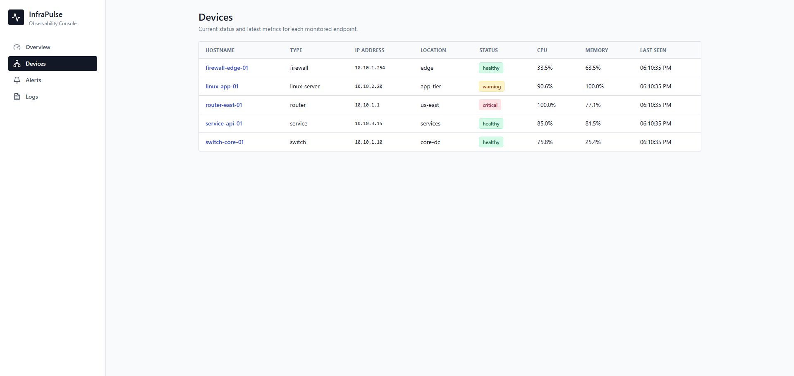
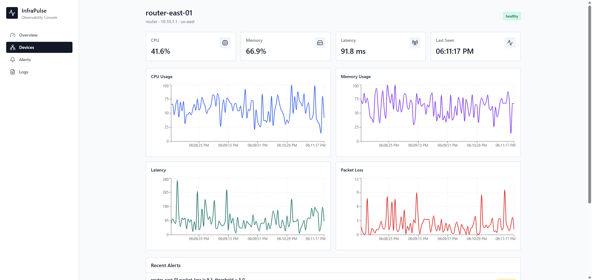
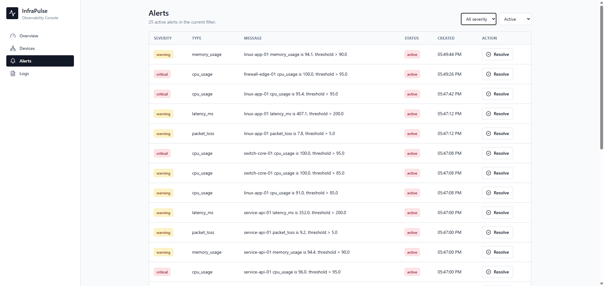
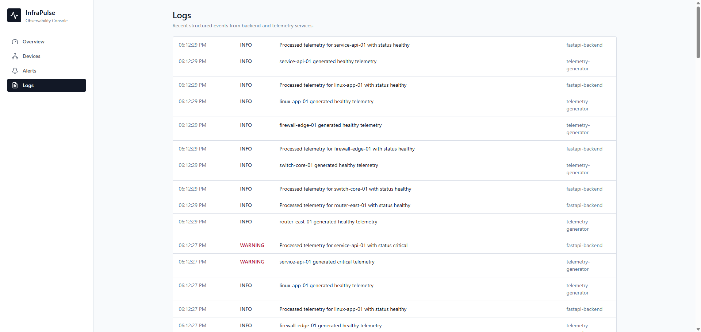
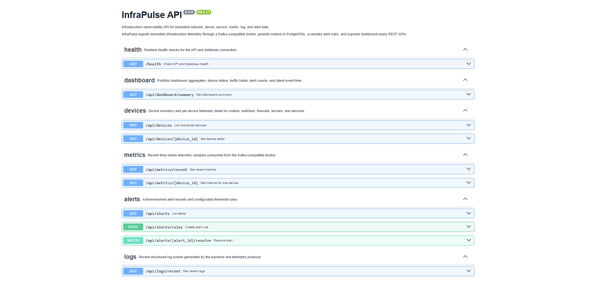
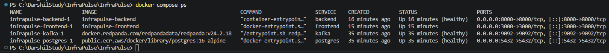
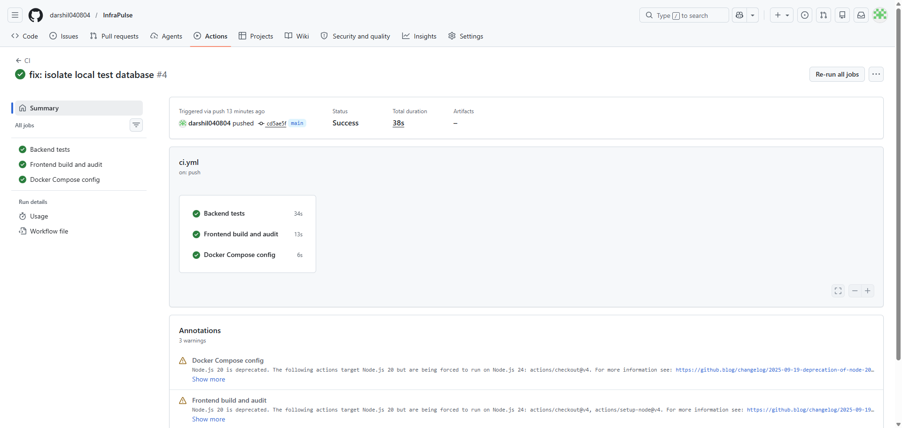
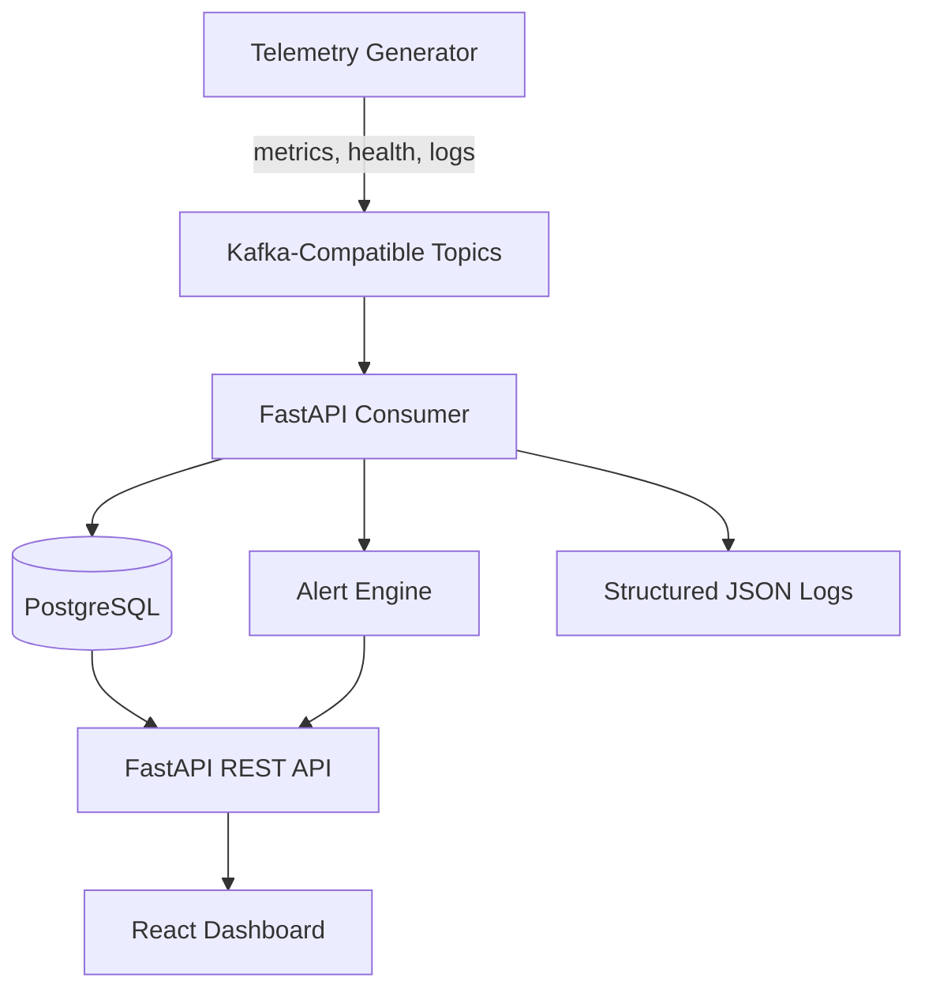

# InfraPulse

[](https://github.com/darshil040804/InfraPulse/actions/workflows/ci.yml)

InfraPulse is a local infrastructure observability platform built with React, FastAPI, PostgreSQL, and a Kafka-compatible event stream. It simulates routers, switches, firewalls, Linux servers, and services, then turns that telemetry into dashboard metrics, alerts, logs, and API responses.



## Highlights

- Simulated infrastructure telemetry for network devices, Linux hosts, and services
- Kafka-compatible event ingestion with Redpanda
- FastAPI backend with PostgreSQL persistence and structured JSON logs
- Alert rule evaluation for CPU, memory, latency, packet loss, and disk usage
- React, TypeScript, Tailwind CSS, and Recharts operations dashboard
- Docker Compose local platform with repeatable demo reset scripts
- GitHub Actions checks for backend tests, frontend build, npm audit, and Compose config
- Ansible playbook for local deployment validation and stack startup

## Tech Stack

| Layer | Tools |
| --- | --- |
| Frontend | React, TypeScript, Vite, Tailwind CSS, Recharts, Axios |
| Backend | FastAPI, SQLAlchemy, Pydantic, Pytest |
| Data | PostgreSQL |
| Streaming | Redpanda as a Kafka-compatible broker |
| Automation | Docker Compose, PowerShell scripts, Ansible |
| CI | GitHub Actions |

## Screenshots

| Overview | Devices |
| --- | --- |
|  |  |

| Device Detail | Alerts |
| --- | --- |
|  |  |

| Logs | API Docs |
| --- | --- |
|  |  |

| Docker Compose Status | CI Passing |
| --- | --- |
|  |  |

## Architecture



The telemetry generator publishes simulated infrastructure events into Redpanda. The FastAPI service consumes those events, stores device and metric history in PostgreSQL, evaluates alert rules, and exposes REST APIs for the React dashboard.

## Run Locally

### Prerequisites

Install and start:

- Git
- Docker Desktop
- Docker Compose v2, included with Docker Desktop

You do not need a local Python or Node install to run the full application. Docker builds and runs the backend, frontend, database, broker, and telemetry generator.

### 1. Clone The Repository

```powershell
git clone https://github.com/darshil040804/InfraPulse.git
cd InfraPulse
```

### 2. Create A Local Environment File

```powershell
copy .env.example .env
```

The included values are local demo defaults. Do not reuse them for production.

### 3. Start The Full Stack

```powershell
docker compose up --build
```

The first run can take a few minutes while Docker downloads base images and builds the services.

### 4. Open The App

After the containers are running, open:

| Service | URL |
| --- | --- |
| React dashboard | http://localhost:3000 |
| FastAPI docs | http://localhost:8000/docs |
| API health check | http://localhost:8000/health |

The telemetry generator starts publishing simulated events automatically. After a short delay, the dashboard should show devices, charts, alerts, and logs.

## Demo Mode

For a stable demo or screenshots, seed deterministic data:

```powershell
.\scripts\start.ps1
.\scripts\reset-demo.ps1
```

`reset-demo.ps1` creates a fixed dataset with:

- 5 infrastructure devices
- 120 recent metric samples
- 5 alerts
- 5 structured log events

It also stops the telemetry generator so the dashboard does not keep changing while screenshots are taken.

To resume live simulated telemetry:

```powershell
docker compose up -d telemetry-generator
```

## Common Commands

```powershell
# Start services in the background
.\scripts\start.ps1

# Reset deterministic demo data
.\scripts\reset-demo.ps1

# Run backend tests, frontend audit/build, and Compose validation
.\scripts\test.ps1

# Stop the stack
.\scripts\stop.ps1

# View backend logs
docker compose logs -f backend

# View telemetry generator logs
docker compose logs -f telemetry-generator
```

Mac/Linux users can run the equivalent Docker commands directly:

```bash
docker compose up -d
docker compose exec backend python -m app.scripts.reset_demo
docker compose run --rm -e DATABASE_URL=sqlite+pysqlite:///:memory: -e ENABLE_KAFKA_CONSUMER=false backend python -m pytest -vv
docker compose down
```

## API Endpoints

Key endpoints:

- `GET /health`
- `GET /api/dashboard/summary`
- `GET /api/devices`
- `GET /api/devices/{hostname}`
- `GET /api/metrics/recent`
- `GET /api/metrics/{hostname}`
- `GET /api/alerts`
- `POST /api/alerts/rules`
- `PATCH /api/alerts/{alert_id}/resolve`
- `GET /api/logs/recent`

Interactive API documentation is available at http://localhost:8000/docs.

## Testing

Run the project checks:

```powershell
.\scripts\test.ps1
```

This command runs backend tests against an isolated in-memory SQLite database, then runs `npm audit`, builds the frontend, and validates the Docker Compose configuration.

## Ansible

The Ansible playbook validates Docker, validates the Compose file, starts the stack, waits for the API health check, and prints useful operator commands.

```powershell
ansible-playbook -i ansible/inventory.ini ansible/deploy.yml
```

Ansible is optional for local use. Docker Compose is enough to run the application.

## Troubleshooting

### Dashboard says the API is unavailable

Check that the backend is running:

```powershell
docker compose ps
docker compose logs --tail=100 backend
```

Then verify the health endpoint:

```powershell
Invoke-RestMethod http://localhost:8000/health
```

If the database is empty or the dashboard has no data, reseed the demo dataset:

```powershell
.\scripts\reset-demo.ps1
```

### Docker image pulls fail with EOF or network errors

Retry the command after Docker Desktop is fully running:

```powershell
docker compose pull
docker compose up --build
```

The Compose file uses Redpanda for Kafka-compatible local development and public/ECR images where practical to reduce Docker Hub pull issues.

### Ports are already in use

The default ports are:

- Frontend: `3000`
- Backend: `8000`
- PostgreSQL: `5432`
- Kafka-compatible broker: `9092`

Stop the conflicting local service or update the ports in `.env` and `docker-compose.yml`.

## Project Structure

```text
backend/              FastAPI app, SQLAlchemy models, Kafka consumer, tests
frontend/             React TypeScript dashboard
telemetry-generator/  Simulated telemetry producer
ansible/              Local deployment automation
docs/                 Architecture notes, API notes, demo guide, screenshots
scripts/              PowerShell helpers for start/reset/test/stop
docker-compose.yml    Local platform orchestration
```

## Portfolio Notes
InfraPulse is designed as a local portfolio project. A public deployment can later host only the React frontend, FastAPI backend, and managed PostgreSQL while keeping Kafka/Redpanda and extended logging as local demo features.
